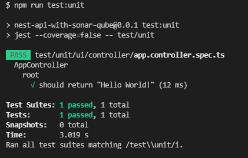
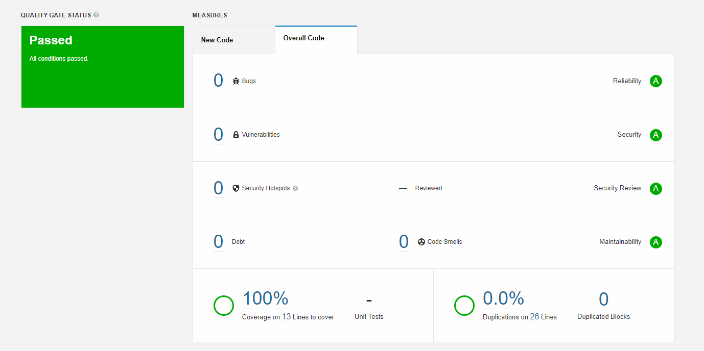
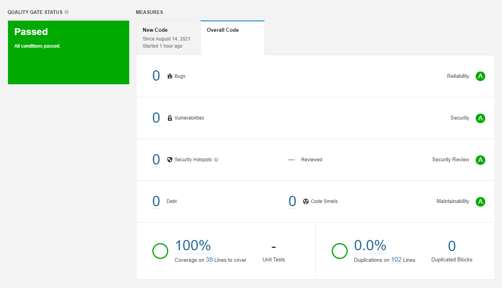

# Asesegurando a qualidade do código de sua API com SonarQube

## @beforeAll

Antes de tudo, quero reiterar que esse é um documento opinativo, baseado nas minhas experiências com a utilização da
ferramenta SonarQube. É possível que, após a escrita desse documento, o meu ponto de vista sobre essa ferramenta mude e
evolua. Também não me considero um mestre do uso da ferramenta aqui apresentada, e talvez a minha pouca experiência gere
algumas opiniões que sejam equivocadas ou incompletas. Portanto, conto com o seu feedback construtivo para que eu possa
continuar a evoluir profissionalmente com o uso dessas ferramentas.

## 1. Introdução

O SonarQube é uma ferramenta que serve para fazer a varredura completa do seu código, gerando um relatório de erros,
falhas, vulnerabilidades, entre outros pontos. Além disso, caso seu projeto tenha testes, ele avalia a cobertura dos
testes do seu código. [MELHORAR DESCRIÇÃO]

// TODO <br/>
É possível validar a qualidade do código escrito em…

Nesse documento irei desenvolver uma API simples do zero com testes, semelhante à API desenvolvida no projeto que falo
sobre [documentação swagger com annotation vs arquivo](https://github.com/lucasrochagit/swagger-annotation-vs-yaml),
para ilustrar o processo de evolução e avaliação contínua da qualidade do código de uma API com o SonarQube.

## 2. Configurando o SonarQube e o SonarScanner

Caso queira reproduzir o desenvolvimento da API, vai ser necessário:

1. Uma IDE favorita (vou usar o [Visual Studio Code](https://code.visualstudio.com/) para esse projeto);
2. O [NodeJS](https://nodejs.org/en/) instalado na sua máquina;
3. O [NestJS](https://nestjs.com/) instalado como biblioteca global do NodeJS;

Para usar o SonarQube, vai ser necessário:

1. A versão 11 ou superior do [Java JDK](https://www.oracle.com/br/java/technologies/javase-jdk11-downloads.html);
2. Baixar o [SonarQube Community](https://www.sonarqube.org/downloads/) (versão usada nesse projeto: 9.0.1);
3. Baixar o [SonarScanner](https://docs.sonarqube.org/latest/analysis/scan/sonarscanner/) (versão usada nesse projeto:
   4.6.2);

// TODO <br/>
O SonarQube é o [...]

Já o SonarScanner é a ferramenta que vai permitir que o seu projeto seja escaneado e validado, e o relatório gerado vai
para o SonarQube. [MELHORAR DESCRIÇÃO]

Segundo as recomendações de instalação da própria plataforma, o SonarQube e o SonarScanner devem ser descompactados na
raiz do disco C. Exemplo:

```
C:\SonarQube
C:\SonarScanner
```

Recomendo que descompacte os arquivos compactos na raiz do disco C e depois renomeie os diretórios conforme acima.

Em seguida, adicione às variáveis de ambiente (de preferência, as variáveis de ambiente de usuário) os seguintes
endereços:

- `C:\SonarQube\bin\windows-x86-64` — Para iniciar o SonarQube de qualquer lugar via terminal, com o
  comando `StartSonar` ou `StartSonar.bat`.
- `C:\SonarScanner\bin` — Para rodar o SonarScanner em qualquer projeto utilizando o comando `sonar-scanner [opts]` ou
  `sonar-scanner.bat [opts]`

## 3. Mãos à obra

### 3.1 First things first

### 3.1.1 Iniciando o projeto

Vamos utilizar o comando `nest new nest-api-with-sonar-qube` no terminal para criar o projeto. Será criado um projeto
com a seguinte estrutura:

```html
src/
    app.controller.spec.ts
    app.controller.ts
    app.module.ts
    app.service.ts
    main.ts
test/
    app.e2e-spec.ts
    jest-e2e.json
```

Após isso, vamos abrir o projeto com o VSCode e realizar as seguintes ações.

1. Remover o arquivo `jest-e2e.json` do diretório `test`.
2. Renomear o arquivo `app-e2e.json` para `app.e2e.spec.ts`, mantendo o padrão `dot.case` no nome dos arquivos.

Logo após, vamos reorganizar o projeto da seguinte forma:

```html
src/
    business/
        service/
            app.service.ts
    infrastructure/
    ui/
        controller/
            app.controller.ts
        module/
            app.module.ts
    main.ts
test/
    e2e/
        app.e2e.spec.ts
    unit/
        ui/
            controller/
                app.controller.spec.ts
```

Onde:

1. `src/business` contém todos os arquivos relacionados à camada de `negócio` da aplicação.
2. `src/infrastructure` contém todos os arquivos relacionados à camada de `infrastrutura` da aplicação.
3. `src/ui` contém todos os arquivos relacionados à camada de `interface` com o cliente da aplicação.
4. `test/e2e` contém todos os testes end-to-end.
5. `test/unit` contém todos os testes unitários.

Depois, é necessário redefinir alguns valores no arquivo `package.json`:

- No objeto `scripts`, altere o valor de `test:e2e` para `jest -- test/e2e`.
- No objeto `jest`,  altere o valor de `rootDir` para `./`.
- No objeto `jest`, altere o valor de `collectCoverageFrom` para `src/**/*.(t|j)s`.
- No objeto `jest`, altere o valor de `coverageDirectory` para `coverage`.

Em seguida, adicione os seguintes valores no `package.json`:

- No objeto `jest`, adicione a chave `collectCoverage` com o valor `true`, para o coverage dos testes seja mensurado por
  padrão.
- No objeto `jest`, adicione a chave `verbose` com o valor `true`, para que seja mostrada uma lista de cada teste 
  executado em cada arquivo de testes (`describe` e `it`).
- No objeto `jest`, adicione no array `collectCoverageFrom` o valor `!src/main.(t|j)s`, para que o arquivo `main` seja
  ignorado na cobertura de testes.
- No objeto `script`, adicione a chave `test:unit` com o valor `jest --coverage=false -- test/unit`. Vai ser útil para
  executar os testes unitários.

Agora, abra o terminal na raiz do projeto (pode ser um terminal externo ou o integrado do VSCode) e execute o
comando `npm test`. O resultado no terminal deve ser semelhante ao da imagem abaixo:


Após isso, execute o comando `npm run test:unit`. O resultado no terminal deve ser semelhante ao da imagem abaixo:



Por fim, execute o comando `npm run test:e2e`. O resultado no terminal deve ser semelhante ao da imagem abaixo:


### 3.1.2 Configurando o Sonar

Primeiro, vamos configurar o SonarQube para manter o rastreio do projeto localmente. Para isso, execute o SonarQube
localmente, abrindo uma instância do terminal e executando o comando `StartSonar` ou `StartSonar.bat`. O Sonar irá ser
carregado e, ao fim do carregamento, acesse no navegador o endereço `http://localhost:9000`. Você será redirecionado
para a tela de login.


Para efetuar o login, use as credenciais `login: admin` e `senha: admin`. Você será redirecionado para a página inicial
do SonarQube.


Selecione a opção `Manually` para iniciar a configuração manual do projeto. Irá aparecer esse menu:


A primeira etapa é definir o nome do projeto. Nesse caso, irei definir como o nome do projeto que está no arquivo
`package.json` da API, que é `nest-api-with-sonar-qube`. Automaticamente, a chave do projeto será definida com o mesmo
nome do projeto. Clique em `Set Up` para continuar. Você será redirecionado para um menu para definir como o seu projeto
irá ser analisado.


Para atender aos propósitos desse projeto, selecione a opção `Locally`. Porém, sinta-se livre para explorar outras
possibilidades futuramente.

Após isso, defina um token para o seu projeto. Esse token será necessário para identificar você no momento em que for
executar o `SonarScanner`.


Você pode colocar qualquer coisa. Para facilitar, irei utilizar o meu usuário do github `lucasrochagit`. Clique em
`Generate`, e depois clique em `Continue`. Após isso, selecione o `build` do seu projeto.


Selecione a opção `Other(for JS, TS, Go, Python, PHP, ...)`, que é o nosso caso. Após isso, selecione o seu sistema
operacional (no meu caso, `Windows`)


Irá aparecer um manual de como configurar o `SonarScanner` (o que já fizemos no tópico 2) e um comando para executar o
`SonarScanner` na raiz do projeto. Não iremos utilizar esse comando propriamente dito, mas iremos executar
o `SonarScanner` de uma forma mais elegante, através de um arquivo de configuração que vai ficar na raiz do projeto.
Para isso, crie um arquivo chamado `sonar-project.properties` na raiz do diretório da API. O arquivo deverá ter os
parâmetros abaixo:

```html
# must be unique in a given SonarQube instance
sonar.projectKey=nest-api-with-sonar-qube

# defaults to project key
sonar.projectName=nest-api-with-sonar-qube

# the sources that should be analyzed
sonar.sources=src

# the sources or files that should not be analyzed
sonar.exclusions=.eslintrc.js,src/main.ts

# the sonar host url
sonar.host.url=http://localhost:9000

# your user token
sonar.login=

# version of project
sonar.projectVersion=1.0

# encoding of the source code
sonar.sourceEncoding=UTF-8

# specify the file that contains the coverage info
sonar.javascript.lcov.reportPaths=coverage/lcov.info
```

Preencha o parâmetro `sonar.login` com o token que foi gerado no passo anterior.

### 3.2 Executando nossa primeira avaliação

Vamos avaliar o nosso código no sonar. Para isso, abra o terminal na raiz do projeto e execute o comando `sonar-scanner`
. Esse processo geralmente é um pouco demorado, portanto, seja paciente.

Enquanto seu projeto está sendo escaneado, caso você deseje subir o seu projeto para o Github ou Gitlab, adicione no
arquivo `.gitignore` da API as seguintes linhas:

```html
# SonarScanner scan dir
.scannerwork

# SonarScanner scan script
sonar-project.properties
```

Caso queira subir um arquivo de exemplo, para que futuramente você ou outras pessoas possam utilizar o `sonar-scanner`
no seu projeto, crie um arquivo chamado `sonar-scanner.properties.example` e adicione os parâmetros supracitados.
Lembre-se de nunca subir para o seu repositório chaves privadas ou conteúdos restritos, logo, deixe o
parâmetro `sonar.login` em branco.

Voltando ao `sonar-scanner`, quando o escaneamento do projeto for concluído, você irá verificar a seguinte mensagem no
terminal:


Portanto, acesse o endereço indicado na primeira linha ou, caso não tenha fechado a aba do `SonarQube`, basta atualizar
a página, e você irá ter o relatório completo do escaneamento do projeto.



Você pode explorar as demais abas para mais detalhes. Mas esse painel inicial já resume tudo que precisamos saber. Até
então nosso código está com a cobertura esperada e sem duplicações ou bad smeels. Vamos partir para a implementação.

### 3.3 Implementando o projeto

Antes de prosseguir a implementação, vamos implementar algumas bibliotecas e realizar algumas configurações. Para isso,
iremos executar o comando:

`npm i --save @nestjs/config @nestjs/typeorm typeorm sqlite3 class-validator class-transformer`

Onde:

- `@nestjs/config`: biblioteca que será útil para leitura de variáveis de ambiente de um arquivo `.env`.
- `@nestjs/typeorm typeorm`: Bibliotecas que irão facilitar a integração da aplicação com banco de dados
- `sqlite3`: banco de dados relacional, que cria e mantém o banco de dados localmente, sem a necessidade de um software
  pré-instalado na máquina, como MySQL.
- `class-validator`: biblioteca que serve para realizar uma série de validação de dados de entrada (será utilizado mais
  na frente, na implementação da camada `ui`)
- `class-transformer`: biblioteca que serve para fazer a serialização/deserialização de uma objeto ou uma classe para
  outra classe (será utilizado mais na frente, na implementação da camada `ui`).

Após instalar as bibliotecas, crie um arquivo chamado `.env` na raiz do projeto. Adicione os seguintes parâmetros:

```text
# PORT
# description: http port from app
# example: 3000
PORT=3000
```

Lembre de adicionar o arquivo `.env` no `.gitignore`. Você pode adicionar da seguinte forma:

```text
# Environment 
.env
```

Considerando que o arquivo `.env` vai ser requerido para o funcionamento correto do sistema, crie também um
arquivo `.env.example` na raiz do projeto, para que futuramente você ou quem for usar o projeto possa ter uma ideia do
comportamento das variáveis de ambiente. Não esqueça de criar o `.env.example` com valores de exemplo, não envie com os
valores do arquivo `.env`.

No arquivo `main.ts`, adicione as configurações de validação. Ele deve estar configurado da seguinte forma:

```ts
import { ValidationPipe } from '@nestjs/common';
import { NestFactory } from '@nestjs/core';
import { AppModule } from './ui/module/app.module';

async function bootstrap() {
    const { PORT } = process.env;
    const app = await NestFactory.create(AppModule);
    app.useGlobalPipes(new ValidationPipe()); // validate submitted data
    await app.listen(PORT);
}

bootstrap();
```

Agora, configure o Typeorm e o módulo de leitura de variáveis de ambiente no arquivo `app.module.ts`. Ele deve estar
configurado da seguinte forma:

```ts
import { Module } from '@nestjs/common';
import { AppController } from '../controller/app.controller';
import { AppService } from '../../business/service/app.service';
import { ConfigModule } from '@nestjs/config';
import { TypeOrmModule } from '@nestjs/typeorm';

@Module({
    imports: [
        ConfigModule.forRoot(), // config used to load environment variables
        TypeOrmModule.forRoot({
            type: 'sqlite', // type of database used on typeorm
            database: '.database/nest-api-with-sonar-qube.db', // database path
            autoLoadEntities: true, // load all entities defined in another modules
            synchronize: true, // sync tables with entity definitions automatically (for dev purposes)
        }),
    ],
    controllers: [AppController],
    providers: [AppService],
})
export class AppModule {
}
```

Feitas as devidas pré configurações, podemos seguir para as implementações. Apenas uma entidade será tratada nessa API:
a entidade `User`. Ela deverá conter os seguintes parâmetros:

```ts
interface User {
    id: number;
    name: string;
    age: number;
    job: string;
}
```

#### 3.3.1 Camada de Infraestrutura

A primeira camada a ser implementada será a camada de infraestrutura. Essa camada deverá ter os seguintes diretórios:

```html
src/
    business/
    infrastructure/
        entity/
        repository/
    ui/
```

Onde:

- `entity`: irá conter as entidades da base de dados.
- `repository`: irá conter as implementações dos repositórios e de suas interfaces;

Vamos criar então a classe `UserEntity`. Para isso, basta criar um arquivo no diretório `src/infrastructure/entity`
denominado `user.entity.ts` . Ele deve estar configurado da seguinte forma:

```ts
import { Column, Entity, PrimaryGeneratedColumn } from 'typeorm';

@Entity('user')
export class UserEntity {
    @PrimaryGeneratedColumn()
    id: number;

    @Column()
    name: string;

    @Column()
    age: number;

    @Column()
    job: string;
}
```

Criada a entidade `UserEntity`, vamos partir para a criação do repositório. De antemão, devemos criar a interface do
repositório da entidade em questão. Eu gosto de criar uma interface genérica, que contém todos os métodos comuns aos
repositórios, que são as operações CRUD, e assim as demais interfaces dos repositórios podem estender a interface
genérica, simplificando a implementação. Portanto, em `src/infrastructure/repository` devemos criar
diretório `interface`. Em `src/infrastructure/repository/interface`, devemos criar o arquivo `repository.interface.ts`
. Ele deve estar configurado da seguinte forma:

```ts
export interface IRepository<Entity, IdType> {
    create(item: Entity): Promise<Entity>;

    find(): Promise<Entity[]>;

    findById(id: IdType): Promise<Entity>;

    update(id: IdType, item: Entity): Promise<Entity>;

    delete(id: IdType): Promise<void>;

    checkExists(params: any): Promise<boolean>;
}
```

Em seguida, devemos criar a interface `IUserRepository`. Para isso, basta criar o arquivo `user.repository.interface.ts`
, no mesmo diretório do arquivo `repository.interface`. Ele deve estar configurado da seguinte forma:

```ts
import { UserEntity } from '../../entity/user.entity';
import { IRepository } from './repository.interface';

export interface IUserRepository extends IRepository<UserEntity, number> {
}
```

Seguindo a linha da interface genérica, eu gosto de criar uma classe, denominada `BaseRepository`. Essa classe deverá
conter todos os métodos comuns aos repositórios, implementando a interface `IRepository` criada anteriormente. Portanto,
no diretório `src/infrastructure/repository` devemos criar um diretório chamado `base` e, no
diretório `src/infrastructure/repository/base`, criamos o arquivo `base.repository.ts`. Ele deve estar configurado da
seguinte forma:

```ts
import { IRepository } from '../interface/repository.interface';
import { FindConditions, Repository } from 'typeorm';

export class BaseRepository<Entity, IdType>
    implements IRepository<Entity, IdType> {
    protected constructor(readonly _repository: Repository<Entity>) {
    }

    async create(item: Entity): Promise<Entity> {
        return this._repository.save(item);
    }

    async find(): Promise<Entity[]> {
        return this._repository.find();
    }

    async findById(id: IdType): Promise<Entity> {
        return this._repository.findOne(id);
    }

    async update(id: IdType, item: Entity): Promise<Entity> {
        return this._repository.save({ id, ...item});
    }

    async delete(id: IdType): Promise<void> {
        await this._repository.delete(id);
    }

    async checkExists(params: FindConditions<Entity>): Promise<boolean> {
        const result: Entity = await this._repository.findOne(params);
        return !!result;
    }
}
```

Você pode se questionar o motivo pelo qual o método `update` e o método `create` chamam o mesmo método do repositório,
denominado `save`. No Typeorm existe o método `update` no repositório, que permite que você atualize uma entidade
passando o identificador da entidade (ex: `id`) e o corpo do objeto a ser atualizado. Porém, esse método não permite a
atualização parcial do objeto, ou seja, você só precisa enviar todos os parâmetros mesmo que alguns não sejam
atualizados. Já o método `save`, caso o objeto a ser salvo seja encontrado através do parâmetro de identificação, os
demais parâmetros serão atualizados, caso contrário, um novo objeto será criado, e ainda possui a vantagem da
atualização parcial. Além disso, utilizar o `update` não retorna uma entidade genérica, mas um objeto
denominado `UpdateResult`. Quando a atualização é bem sucedida, o objeto atualizado é retornado dentro de um array em
uma propriedade denominada `raw` e, visualmente, não fica tão bacana. Portanto, além de permitir atualização parcial,
utilizar o `save` deixa o código bem mais bonito. Contudo, lembre-se de assegurar que o objeto atualizado exista, para
que a atualização seja bem sucedida.

Já na operação de `delete`, o repositório do `Typeorm` retorna um objeto do tipo `DeleteResult`. Porém, para essa
aplicação, como não me interessa saber se o objeto foi deletado ou não, apenas se faz necessário aguardar a operação e,
caso a chamada ao repositório gere algum erro, o mesmo seja lançado.

Após isso, podemos implementar a classe `UserRepository`. Para isso, basta criar um arquivo no
diretório `src/infrastructure/repository` denominado `user.repository.ts` . Ele deve estar configurado da seguinte
forma:

```ts
import { Injectable } from '@nestjs/common';
import { InjectRepository } from '@nestjs/typeorm';
import { Repository } from 'typeorm';
import { UserEntity } from '../entity/user.entity';
import { BaseRepository } from './base/base.repository';
import { IUserRepository } from './interface/user.repository.interface';

@Injectable()
export class UserRepository
    extends BaseRepository<UserEntity, number>
    implements IUserRepository {
    constructor(
        @InjectRepository(UserEntity)
        readonly _repository: Repository<UserEntity>,
    ) {
        super(_repository);
    }
}
```

Agora vamos implementar os testes da camada de infraestrutura.

O primeiro passo é criar um diretório onde serão criados os mocks dos objetos usados nos testes, no intuito de
centralizar e organizar em uma classe por entidade. Para isso, vamos criar o diretório `mock` em `test`. Após isso, no
diretório `test/mock`, vamos criar o arquivo `user.mock.ts`. Ele deve estar configurado da seguinte forma:

```ts
import { UserEntity } from '../../src/infrastructure/entity/user.entity';

export class UserMock {
    public static get entity(): UserEntity {
        const entity: UserEntity = new UserEntity();
        entity.id = 1;
        entity.name = 'John Doe';
        entity.age = 26;
        entity.job = 'Developer';
        return entity;
    }
}
```

Agora vamos iniciar a implementação dos testes. Eu particularmente gosto de utilizar a biblioteca `sinon` para criar os
mocks das dependências que são injetadas nas classes. Para usá-lo, utilize o comando `npm i -D sinon @types/sinon` para
instalar a biblioteca como dependência de desenvolvimento.

Podemos também definir um script para executar os testes de um contexto específico. Para isso, defina no
objeto `scripts` do arquivo `package.json` a chave `test:match` com o valor `jest --coverage=false --`. Para usar esse
comando é simples. Caso queira executar apenas os testes dos controllers, execute o
comando `npm run test:match controller.spec`. Nesse caso, todos os arquivos de testes que contém `controller.spec` serão
executados. Você pode especificar também o nome completo do arquivo, como `npm run test:match app.controller.spec`, e
apenas os testes do arquivo `app.controller.spec` serão executados.

Em seguida, vamos criar os diretórios onde serão criados os arquivos de testes. Vamos criar o diretório `infrastructure`
em `test/unit` e, em seguida, criar o diretório `repository` em `test/unit/infrastructure`. Nesse diretório, devemos
criar o arquivo `user.repository.spec.ts`, que irá conter os testes unitários da classe `UserRepository`. A configuração
inicial é a seguinte:

```ts
import { mock } from 'sinon';
import { UserEntity } from '../../../src/infrastructure/entity/user.entity';
import { UserRepository } from '../../../src/infrastructure/repository/user.repository';
import { UserMock } from '../../mock/user.mock';

describe('UserRepository', () => {
    let userRepository: UserRepository;
    let typeOrmRepository: any;
  
    beforeAll(() => {
      typeOrmRepository = mock();
      userRepository = new UserRepository(typeOrmRepository);
    });
});
```

Perceba que o `typeOrmRepository` como um mock, ou seja, possível definir e controlar os métodos que pertencem a essa
classe e seus comportamentos. Em seguida, esse mock foi injetado no construtor do `userRepository`, como se fosse a
injeção de dependência do próprio `Repository` do `Typeorm`. Após isso, vamos iniciar os testes de cada chamada
do `userRepository`. Existem duas situações que são testadas aqui: uma chamada de sucesso e uma chamada de erro. Isso
porque não existe nenhuma condicional durante a execução do fluxo do repositório além dessas: ou a ação é realizada, ou
gera um erro. É possível que você possa testar as diversas situações de erro que podem ser geradas
pelo `typOrmRepository`, mas esse não é o foco desse projeto em questão.

Após a execução dos testes de cada método, você pode utilizar o comando `npm run test:match user.repository.spec` e
verificar se os testes estão funcionando corretamente. Essas serão as situações testadas para cada método:

- `create()`: o método `create()` possui o retorno de sucesso o retorno de erro.
- `find()`: o método `find()` possui duas situações de sucesso além do retorno de erro. Caso existam usuários, o método
  retorna um array de usuários e, caso contrário, retorna um array vazio.
- `findById()`: o método `findById()` possui o retorno de sucesso e o retorno de erro.
- `update()`: o método `update()`possui o retorno de sucesso o retorno de erro.
- `delete()`: o método `delete` não irá retornar nada, exceto em caso de erro.
- `checkExists()`: o método `checkExists()` pode retornar `true` ou `false`, para indicar se o usuário existe ou não,
  além do retorno de erro.

Dadas as situações, os testes devem ser implementados da seguinte forma:

```ts
import { mock } from 'sinon';
import { UserEntity } from '../../../../src/infrastructure/entity/user.entity';
import { UserRepository } from '../../../../src/infrastructure/repository/user.repository';
import { UserMock } from '../../../mock/user.mock';

describe('UserRepository', () => {
  let userRepository: UserRepository;
  let typeOrmRepository: any;

  beforeAll(() => {
    typeOrmRepository = mock();
    userRepository = new UserRepository(typeOrmRepository);
  });

  describe('create()', () => {
    describe('when create is successful', () => {
      it('should return the created entity', async () => {
        typeOrmRepository.save = jest
                .fn()
                .mockImplementation(() => Promise.resolve(UserMock.entity));
        const result: UserEntity = await userRepository.create(UserMock.entity);
        expect(result).toMatchObject(UserMock.entity);
      });
    });

    describe('when an error is thrown', () => {
      it('should throw the error', async () => {
        typeOrmRepository.save = jest
                .fn()
                .mockImplementation(() =>
                        Promise.reject({ message: 'Database error' }),
                );
        try {
          await userRepository.create(UserMock.entity);
        } catch (error) {
          expect(error).toHaveProperty('message', 'Database error');
        }
      });
    });
  });

  describe('find()', () => {
    describe('when find is successful', () => {
      it('should return the found entity list when there are entities', async () => {
        typeOrmRepository.find = jest
                .fn()
                .mockImplementation(() => Promise.resolve([UserMock.entity]));
        const result: UserEntity[] = await userRepository.find();
        expect(result).toMatchObject([UserMock.entity]);
      });
      it('should return an empty entity list when there are no entities', async () => {
        typeOrmRepository.find = jest
                .fn()
                .mockImplementation(() => Promise.resolve([]));
        const result: UserEntity[] = await userRepository.find();
        expect(result).toMatchObject([]);
      });
    });

    describe('when an error is thrown', () => {
      it('should throw the error', async () => {
        typeOrmRepository.find = jest
                .fn()
                .mockImplementation(() =>
                        Promise.reject({ message: 'Database error' }),
                );
        try {
          await userRepository.create(UserMock.entity);
        } catch (error) {
          expect(error).toHaveProperty('message', 'Database error');
        }
      });
    });
  });

  describe('findById()', () => {
    describe('when findById is successful', () => {
      it('should return the found entity', async () => {
        typeOrmRepository.findOne = jest
                .fn()
                .mockImplementation(() => Promise.resolve(UserMock.entity));
        const result: UserEntity = await userRepository.findById(
                UserMock.entity.id,
        );
        expect(result).toMatchObject(UserMock.entity);
      });
    });

    describe('when an error is thrown', () => {
      it('should throw the error', async () => {
        typeOrmRepository.findOne = jest
                .fn()
                .mockImplementation(() =>
                        Promise.reject({ message: 'Database error' }),
                );
        try {
          await userRepository.findById(UserMock.entity.id);
        } catch (error) {
          expect(error).toHaveProperty('message', 'Database error');
        }
      });
    });
  });

  describe('update()', () => {
    describe('when update is successful', () => {
      it('should return the updated entity', async () => {
        typeOrmRepository.save = jest
                .fn()
                .mockImplementation(() => Promise.resolve(UserMock.entity));
        const result: UserEntity = await userRepository.update(
                UserMock.entity.id,
                UserMock.entity,
        );
        expect(result).toMatchObject(UserMock.entity);
      });
    });

    describe('when an error is thrown at update', () => {
      it('should throw the error', async () => {
        typeOrmRepository.save = jest
                .fn()
                .mockImplementation(() =>
                        Promise.reject({ message: 'Database error' }),
                );
        try {
          await userRepository.update(UserMock.entity.id, UserMock.entity);
        } catch (error) {
          expect(error).toHaveProperty('message', 'Database error');
        }
      });
    });
  });

  describe('delete()', () => {
    describe('when delete is successful', () => {
      it('should return anything', async () => {
        typeOrmRepository.delete = jest
                .fn()
                .mockImplementation(() => Promise.resolve(UserMock.entity));
        await userRepository.delete(UserMock.entity.id);
      });
    });

    describe('when an error is thrown', () => {
      it('should throw the error', async () => {
        typeOrmRepository.delete = jest
                .fn()
                .mockImplementation(() =>
                        Promise.reject({ message: 'Database error' }),
                );
        try {
          await userRepository.delete(UserMock.entity.id);
        } catch (error) {
          expect(error).toHaveProperty('message', 'Database error');
        }
      });
    });
  });

  describe('checkExists()', () => {
    describe('when checkExists is successful', () => {
      it('should return true if entity exists', async () => {
        typeOrmRepository.findOne = jest
                .fn()
                .mockImplementation(() => Promise.resolve(UserMock.entity));
        const result: boolean = await userRepository.checkExists({
          id: UserMock.entity.id,
        });
        expect(result).toEqual(true);
      });
      it('should return false if entity does not exists', async () => {
        typeOrmRepository.findOne = jest
                .fn()
                .mockImplementation(() => Promise.resolve(undefined));
        const result: boolean = await userRepository.checkExists({
          id: UserMock.entity.id,
        });
        expect(result).toEqual(false);
      });
    });

    describe('when an error is thrown', () => {
      it('should throw the error', async () => {
        typeOrmRepository.findOne = jest
                .fn()
                .mockImplementation(() =>
                        Promise.reject({ message: 'Database error' }),
                );
        try {
          await userRepository.checkExists({ id: UserMock.entity.id });
        } catch (error) {
          expect(error).toHaveProperty('message', 'Database error');
        }
      });
    });
  });
});
```

Após implementar todos os testes, e assegurar que os mesmos estão funcionando corretamente e com uma cobertura
aceitável, vamos realizar um novo escaneamento do nosso projeto e atualizar o relatório do `SonarQube`. Certifique-se de
que o `SonarQube` está rodando na sua máquina local. Em seguida, na raiz do projeto, execute o comando `sonar-scanner`.
O resultado deverá ser como esse:



#### 3.3.2 Camada de Negócio

Agora vamos implementar a camada de negócio. Essa camada deverá ter os seguintes diretórios:

```html
src/
    business/
        mapper/
        model/
        service/
    infrastructure/
    ui/
```

Onde:

- `mapper`: irá conter a implementação dos mapeadores e suas interfaces, que irão transformar `models` em `entities` e
  vice-versa.
- `model`: irá conter a implementação dos modelos de dados da camada de negócio.
- `service`: irá conter as implementações dos serviços e de suas interfaces;

Vamos criar a classe `UserModel`. Para isso, basta criar um arquivo no diretório `src/business/model`, denominado
`user.model.ts`. Ele deve estar configurado da seguinte forma:

```ts
export class UserModel {
    private _id: number;
    private _name: string;
    private _age: number;
    private _job: string;

    get id(): number {
        return this._id;
    }

    set id(value: number) {
        this._id = value;
    }

    get name(): string {
        return this._name;
    }

    set name(value: string) {
        this._name = value;
    }

    get age(): number {
        return this._age;
    }

    set age(value: number) {
        this._age = value;
    }

    get job(): string {
        return this._job;
    }

    set job(value: string) {
        this._job = value;
    }
}
```

Criado o modelo `UserModel`, vamos partir para a implementação do mapeador. Seguindo a estratégia de criar interfaces
genéricas da implementação dos `repositórios`, em `src/business/mapper` vamos criar o diretório `interface` e, nesse
diretório, criar o arquivo `model.mapper.interface.ts`. Ele deve estar configurado da seguinte forma:

```ts
export interface IModelMapper<Model, Entity> {
    serialize(item: Entity): Model;

    deserialize(item: Model): Entity;
}
```

Em seguida, vamos criar a interface do mapeador do `UserModel`. Para isso, no diretório `src/business/mapper/interface`,
vamos criar o arquivo `user.model.mapper.interface.ts`. Ele deve estar configurado da seguinte forma:

```ts
import { UserEntity } from '../../../infrastructure/entity/user.entity';
import { UserModel } from '../../model/user.model';
import { IModelMapper } from './model.mapper.interface';

export interface IUserModelMapper extends IModelMapper<UserModel, UserEntity> {
}
```

Logo após, vamos criar a classe mapeadora. No diretório `src/business/mapper`, vamos criar o arquivo `user.model.mapper`
. Ele deve estar configurado da seguinte forma:

```ts
import { Injectable } from '@nestjs/common'
import { UserEntity } from '../../infrastructure/entity/user.entity'
import { UserModel } from '../model/user.model'
import { IUserModelMapper } from './interface/user.model.mapper.interface'

@Injectable()
export class UserModelMapper implements IUserModelMapper {
    deserialize(item: UserModel): UserEntity {
        const result: UserEntity = new UserEntity();
        if (item.name) result.name = item.name;
        if (item.age) result.age = item.age;
        if (item.job) result.job = item.job;
        return result;
    }

    serialize(item: UserEntity): UserModel {
        const result: UserModel = new UserModel();
        if (item.id) result.id = item.id;
        if (item.name) result.name = item.name;
        if (item.age) result.age = item.age;
        if (item.job) result.job = item.job;
        return result;
    }
}
```

Finalizada a implementação do mapeador, vamos partir para a implementação do serviço. Assim como o `mapper` e
o `repository`, também é interessante definir as interfaces de serviços. Seguindo a linha de interface genérica, crie o
diretório  `interface` em `src/business/service` e, messe diretório, crie o arquivo `service.interface.ts`. Ele deverá
estar configurado da seguinte forma:

```ts
export interface IService<Model> {
    create(item: Model): Promise<Model>;

    find(): Promise<Model[]>;

    findById(id: number): Promise<Model>;

    update(id: number, item: Model): Promise<Model>;

    delete(id: number): Promise<void>;
}
```

Em seguida, no diretório `src/business/service/interface`, crie o arquivo `user.service.interface.ts`. Ele deverá estar
configurado da seguinte forma:

```ts
import { UserModel } from '../../model/user.model';
import { IService } from './service.interface';

export interface IUserService extends IService<UserModel> {
}
```

Por fim, no diretório `src/business/service`, crie o arquivo `user.service.ts`. Ele deve estar configurado da seguinte
forma:

```ts
import {
    Injectable,
    InternalServerErrorException,
    NotFoundException,
} from '@nestjs/common';
import { UserEntity } from '../../infrastructure/entity/user.entity';
import { UserRepository } from '../../infrastructure/repository/user.repository';
import { UserModelMapper } from '../mapper/user.model.mapper';
import { UserModel } from '../model/user.model';
import { IUserService } from './interface/user.service.interface';

@Injectable()
export class UserService implements IUserService {
    constructor(
        private readonly _repository: UserRepository,
        private readonly _mapper: UserModelMapper,
    ) {
    }

    async create(item: UserModel): Promise<UserModel> {
        try {
            const entity: UserEntity = this._mapper.deserialize(item);
            const result: UserEntity = await this._repository.create(entity);
            return this._mapper.serialize(result);
        } catch (err) {
            throw this.getInternalServerErrorException();
        }
    }

    async find(): Promise<UserModel[]> {
        try {
            const result: UserEntity[] = await this._repository.find();
            return result.map((item: UserEntity) => this._mapper.serialize(item));
        } catch (err) {
            throw this.getInternalServerErrorException();
        }
    }

    async findById(id: number): Promise<UserModel> {
        try {
            await this.checkIfExistsById(id);
            const result: UserEntity = await this._repository.findById(id);
            return this._mapper.serialize(result);
        } catch (err) {
            if (err instanceof NotFoundException) {
                throw err;
            }
            throw this.getInternalServerErrorException();
        }
    }

    async update(id: number, item: UserModel): Promise<UserModel> {
        try {
            await this.checkIfExistsById(id);
            const entity: UserEntity = this._mapper.deserialize(item);
            const result: UserEntity = await this._repository.update(id, entity);
            return this._mapper.serialize(result);
        } catch (err) {
            if (err instanceof NotFoundException) {
                throw err;
            }
            throw this.getInternalServerErrorException();
        }
    }

    async delete(id: number): Promise<void> {
        try {
            await this._repository.delete(id);
        } catch (err) {
            throw this.getInternalServerErrorException();
        }
    }

    private async checkIfExistsById(id: number): Promise<void> {
        const exists = await this._repository.checkExists({ id });
        if (!exists) {
            throw new NotFoundException('User not found or already removed.');
        }
    }

    private getInternalServerErrorException(): InternalServerErrorException {
        return new InternalServerErrorException(
            'Due to an internal error, the operation could not be performed at this time. Please try again later.',
        );
    }
}
```

Finalizada a implementação da camada de negócio, vamos partir para a implementação dos testes. Nessa camada, deveremos
implementar testes unitários para os `mappers` e os `services`. Vamos começar pelos `mappers`.

Antes de iniciar os testes dos `mappers`, em `test/mock/user.mock.ts`, adicione dois métodos: um para retornar um mock
de um `UserModel`, e outro para retornar um `UserModel` deserializado, ou seja, um `UserEntity` sem o `id`. Nesse caso,
a classe `UserMock` deve estar implementada da seguinte forma:

```ts
import { UserModel } from '../../src/business/model/user.model'
import { UserEntity } from '../../src/infrastructure/entity/user.entity';

export class UserMock {
    public static get entity(): UserEntity {
        const entity: UserEntity = new UserEntity();
        entity.id = 1;
        entity.name = 'John Doe';
        entity.age = 26;
        entity.job = 'Developer';
        return entity;
    }

    public static get model(): UserModel {
        const model: UserModel = new UserModel();
        model.id = 1;
        model.name = 'John Doe';
        model.age = 26;
        model.job = 'Developer';
        return model;
      }
    
      public static get deserializedModel(): UserEntity {
        const entity: UserEntity = new UserEntity();
        entity.name = 'John Doe';
        entity.age = 26;
        entity.job = 'Developer';
        return entity;
      }
}
```

Nos testes do `UserModelMapper`, existem duas condições principais que devem ser testadas para cada método: a situação
do objeto a ser mapeado conter todos os parâmetros e também a situação de não conter nenhum. Você também pode testar
situações de `undefined`, ou de não serem mapeados parâmetros específicos, para verificar se o comportamento do `mapper`
realmente está correto, porém, para simplificar a implementação, não irei me ater a esses casos de teste nesse projeto.

No diretório `test/unit`, crie o diretório `business` e, nesse diretório, crie o diretório `mapper`. Logo após, em
`test/unit/business/mapper`, crie o arquivo `user.model.mapper.spec`. Como já definimos quais condições devem ser
testadas em cada método, o arquivo deverá ser configurado da seguinte forma:

```ts
import { UserModelMapper } from '../../../../src/business/mapper/user.model.mapper';
import { UserModel } from '../../../../src/business/model/user.model';
import { UserEntity } from '../../../../src/infrastructure/entity/user.entity';
import { UserMock } from '../../../mock/user.mock';

describe('UserModelMapper', () => {
    const userModelMapper = new UserModelMapper();

    describe('deserialize()', () => {
        describe('when deserialize a model to entity', () => {
            it('should return the deserialized entity', () => {
                const result: UserEntity = userModelMapper.deserialize(UserMock.model);
                expect(result).toMatchObject(UserMock.deserializedModel);
            });
        });

        describe('when the model is empty', () => {
            it('should return an empty entity', () => {
                const result: UserEntity = userModelMapper.deserialize(new UserModel());
                expect(result).toMatchObject(new UserEntity());
            });
        });
    });

    describe('serialize()', () => {
        describe('when serialize a entity to model', () => {
            it('should return the serialized model', () => {
                const result: UserModel = userModelMapper.serialize(UserMock.entity);
                expect(result).toMatchObject(UserMock.model);
            });
        });

        describe('when the entity is empty', () => {
            it('should return an empty model', () => {
                const result: UserModel = userModelMapper.serialize(new UserEntity());
                expect(result).toMatchObject(new UserModel());
            });
        });
    });
});
```

Em seguida, nos testes do `UserService`, teremos as seguintes situações que devem ser testadas para cada método:

- `create()`: o método `create()` possui o retorno de sucesso o retorno de erro.
- `find()`: o método `find()` possui duas situações de sucesso além do retorno de erro. Caso existam usuários, o método
  retorna um array de usuários e, caso contrário, retorna um array vazio.
- `findById()`: o método `findById()` possui o retorno de sucesso e dois retornos de erro: caso o usuário não exista
  através do id informado e caso o repositório retorne um erro.
- `update()`: o método `update()` possui uma peculiaridade, que é a realização de uma verificação se o usuário existe
  através do id informado e uma operação de atualização, além do retorno de erro, que pode acontecer tanto na
  verificação quanto na atualização.
- `delete()`: o método `delete` não irá retornar nada, exceto em caso de erro.

Dadas as situações, os testes devem ser implementados da seguinte forma:

```ts
import { mock } from 'sinon';
import { UserModelMapper } from '../../../../src/business/mapper/user.model.mapper';
import { UserModel } from '../../../../src/business/model/user.model';
import { UserService } from '../../../../src/business/service/user.service';
import { UserMock } from '../../../mock/user.mock';

describe('UserService', () => {
    let userRepository: any;
    let userModelMapper: UserModelMapper;
    let userService: UserService;

    beforeAll(() => {
        userModelMapper = new UserModelMapper();
        userRepository = mock();
        userService = new UserService(userRepository, userModelMapper);
    });

    describe('create()', () => {
        describe('when create is successful', () => {
            it('should return the created model', async () => {
                userRepository.create = jest
                    .fn()
                    .mockImplementation(() => Promise.resolve(UserMock.entity));

                const result: UserModel = await userService.create(UserMock.model);
                expect(result).toMatchObject(UserMock.model);
            });
        });

        describe('when an error is thrown', () => {
            it('should throw the error', async () => {
                userRepository.create = jest
                    .fn()
                    .mockImplementation(() =>
                        Promise.reject({ message: 'Sensitive repository error' }),
                    );
                try {
                    await userService.create(UserMock.model);
                } catch (err) {
                    expect(err).toHaveProperty(
                        'message',
                        'Due to an internal error, the operation could not be performed at this time. Please try again later.',
                    );
                }
            });
        });
    });

    describe('find()', () => {
        describe('when find is successful', () => {
            it('should return the found model list when there are models', async () => {
                userRepository.find = jest
                    .fn()
                    .mockImplementation(() => Promise.resolve([UserMock.entity]));

                const result: UserModel[] = await userService.find();
                expect(result).toMatchObject([UserMock.model]);
            });
            it('should return an empty model list when there are no models', async () => {
                userRepository.find = jest
                    .fn()
                    .mockImplementation(() => Promise.resolve([]));

                const result: UserModel[] = await userService.find();
                expect(result).toMatchObject([]);
            });
        });

        describe('when an error is thrown', () => {
            it('should throw the error', async () => {
                userRepository.find = jest
                    .fn()
                    .mockImplementation(() =>
                        Promise.reject({ message: 'Sensitive repository error' }),
                    );
                try {
                    await userService.find();
                } catch (err) {
                    expect(err).toHaveProperty(
                        'message',
                        'Due to an internal error, the operation could not be performed at this time. Please try again later.',
                    );
                }
            });
        });
    });

    describe('findById()', () => {
        describe('when findById is successful', () => {
            it('should return the found entity', async () => {
                userRepository.checkExists = jest
                    .fn()
                    .mockImplementation(() => Promise.resolve(true));
                userRepository.findById = jest
                    .fn()
                    .mockImplementation(() => Promise.resolve(UserMock.entity));
                const result: UserModel = await userService.findById(UserMock.model.id);
                expect(result).toMatchObject(UserMock.model);
            });
        });

        describe('when the model is not found', () => {
            it('should throw the error for model not founded', async () => {
                userRepository.checkExists = jest
                    .fn()
                    .mockImplementation(() => Promise.resolve(false));

                try {
                    await userService.findById(UserMock.model.id);
                } catch (err) {
                    expect(err).toHaveProperty(
                        'message',
                        'User not found or already removed.',
                    );
                }
            });
        });

        describe('when an error is thrown', () => {
            it('should throw the error', async () => {
                userRepository.checkExists = jest
                    .fn()
                    .mockImplementation(() =>
                        Promise.reject({ message: 'Sensitive repository error' }),
                    );

                try {
                    await userService.findById(UserMock.model.id);
                } catch (err) {
                    expect(err).toHaveProperty(
                        'message',
                        'Due to an internal error, the operation could not be performed at this time. Please try again later.',
                    );
                }
            });
        });
    });

    describe('update()', () => {
        describe('when update is successful', () => {
            it('should return the found entity', async () => {
                userRepository.checkExists = jest
                    .fn()
                    .mockImplementation(() => Promise.resolve(true));
                userRepository.update = jest
                    .fn()
                    .mockImplementation(() => Promise.resolve(UserMock.entity));
                const result: UserModel = await userService.update(
                    UserMock.model.id,
                    UserMock.model,
                );
                expect(result).toMatchObject(UserMock.model);
            });
        });

        describe('when the model is not found', () => {
            it('should throw the error for model not founded', async () => {
                userRepository.checkExists = jest
                    .fn()
                    .mockImplementation(() => Promise.resolve(false));

                try {
                    await userService.update(UserMock.model.id, UserMock.model);
                } catch (err) {
                    expect(err).toHaveProperty(
                        'message',
                        'User not found or already removed.',
                    );
                }
            });
        });

        describe('when an error is thrown', () => {
            it('should throw the error', async () => {
                userRepository.checkExists = jest
                    .fn()
                    .mockImplementation(() =>
                        Promise.reject({ message: 'Sensitive repository error' }),
                    );

                try {
                    await userService.update(UserMock.model.id, UserMock.model);
                } catch (err) {
                    expect(err).toHaveProperty(
                        'message',
                        'Due to an internal error, the operation could not be performed at this time. Please try again later.',
                    );
                }
            });
        });
    });

    describe('delete()', () => {
        describe('when delete is successful', () => {
            it('should return anything', async () => {
                userRepository.delete = jest
                    .fn()
                    .mockImplementation(() => Promise.resolve());
                await userService.delete(UserMock.entity.id);
            });
        });

        describe('when an error is thrown', () => {
            it('should throw the error', async () => {
                userRepository.delete = jest
                    .fn()
                    .mockImplementation(() =>
                        Promise.reject({ message: 'Sensitive repository error' }),
                    );
                try {
                    await userService.delete(UserMock.entity.id);
                } catch (err) {
                    expect(err).toHaveProperty(
                        'message',
                        'Due to an internal error, the operation could not be performed at this time. Please try again later.',
                    );
                }
            });
        });
    });
});
```

Após implementar todos os testes, e assegurar que os mesmos estão funcionando corretamente e com uma cobertura
aceitável, vamos realizar um novo escaneamento do nosso projeto e atualizar o relatório do `SonarQube`. Certifique-se de
que o `SonarQube` está rodando na sua máquina local. Em seguida, na raiz do projeto, execute o comando `sonar-scanner`.
O resultado deverá ser como esse:


#### 3.3.3 Camada de UI

Por fim, vamos implementar a camada de interface do usuário. Essa camada deverá possuir os seguintes diretórios:

```html
src/
    business/
    infrastructure/
    ui/
        controller/
        dto/
        mapper/
        module/
```

Onde:

- `controller`: irá conter todos os `controllers` da camada de interface;
- `dto`: irá conter a implementação dos `data transfer objects` de dados da camada de interface.
- `mapper`: irá conter a implementação dos mapeadores e suas interfaces, que irão transformar `dtos` em `models` e
  vice-versa.
- `module`: irá conter as implementações dos módulos da aplicação.

Vamos começar pela implementação do `UserDTO`. Para isso, basta criar um arquivo no diretório `src/ui/dto`, denominado
`user.dto.ts`. Ele deve estar configurado da seguinte forma:

```ts
import { IsInt, IsNotEmpty, IsString, Min } from 'class-validator';

export class UserDTO {
  id: number;

  @IsString()
  @IsNotEmpty()
  name: string;

  @IsInt()
  @Min(18)
  age: number;

  @IsString()
  @IsNotEmpty()
  job: string;
}
```

As anotações são validações que deverão ser feitas assim que a classe for instanciada. Caso algum parâmetro não esteja
em conforme com as regras definidas nas anotações, um erro de validação será lançado para o cliente, como
uma `BadRequestException`, informando quais parâmetros estão incorretos e quais regras definidas foram quebradas.
Veremos isso adiante, durante a execução dos testes.

Criado o dto `UserDTO`, vamos partir para a implementação do mapeador. Seguindo a estratégia de criar interfaces
genéricas, em `src/ui/mapper` vamos criar o diretório `interface` e, nesse diretório, criar o
arquivo `dto.mapper.interface.ts`. Ele deve estar configurado da seguinte forma:

```ts
export interface IDTOMapper<DTO, Model> {
  serialize(item: Model): DTO;

  deserialize(item: DTO): Model;
}
```

Em seguida, vamos criar a interface do mapeador do `UserDTO`. Para isso, no diretório `src/ui/mapper/interface`,
vamos criar o arquivo `user.dto.mapper.interface.ts`. Ele deve estar configurado da seguinte forma:

```ts
import { UserModel } from '../../../business/model/user.model';
import { UserDTO } from '../../../ui/dto/user.dto';
import { IDTOMapper } from './dto.mapper.interface';

export interface IUserDTOMapper extends IDTOMapper<UserDTO, UserModel> {}
```

Logo após, vamos criar a classe mapeadora. No diretório `src/ui/mapper`, vamos criar o arquivo `user.dto.mapper`
. Ele deve estar configurado da seguinte forma:

```ts
import { Injectable } from '@nestjs/common';
import { UserModel } from '../../business/model/user.model';
import { UserDTO } from '../dto/user.dto';
import { IUserDTOMapper } from './interface/user.dto.mapper.interface';

@Injectable()
export class UserDTOMapper implements IUserDTOMapper {
  deserialize(item: UserDTO): UserModel {
    const result: UserModel = new UserModel();
    if (item.name) result.name = item.name;
    if (item.age) result.age = item.age;
    if (item.job) result.job = item.job;
    return result;
  }

  serialize(item: UserModel): UserDTO {
    const result: UserDTO = new UserDTO();
    if (item.id) result.id = item.id;
    if (item.name) result.name = item.name;
    if (item.age) result.age = item.age;
    if (item.job) result.job = item.job;
    return result;
  }
}
```

Finalizada a implementação do mapeador, vamos partir para a implementação do controlador. O controlador não precisa de
interface. Em `src/ui/controller`, vamos criar o arquivo `user.controller.ts`. Ele deverá possuir a seguinte
configuração:

```ts
import {
  Body,
  Controller,
  Delete,
  Get,
  HttpCode,
  HttpStatus,
  Param,
  Post,
  Put,
} from '@nestjs/common';
import { UserModel } from '../../business/model/user.model';
import { UserService } from '../../business/service/user.service';
import { UserDTO } from '../dto/user.dto';
import { UserDTOMapper } from '../mapper/user.dto.mapper';

@Controller('users')
export class UserController {
  constructor(
          private readonly _service: UserService,
          private readonly _mapper: UserDTOMapper,
  ) {}

  @Post()
  async create(@Body() userDTO: UserDTO): Promise<UserDTO> {
    const model: UserModel = this._mapper.deserialize(userDTO);
    const result: UserModel = await this._service.create(model);
    return this._mapper.serialize(result);
  }

  @Get()
  async find(): Promise<UserDTO[]> {
    const result: UserModel[] = await this._service.find();
    return result.map((model) => this._mapper.serialize(model));
  }

  @Get(':id')
  async findById(@Param('id') id: number): Promise<UserDTO> {
    const result: UserModel = await this._service.findById(id);
    return this._mapper.serialize(result);
  }

  @Put(':id')
  async update(
          @Param('id') id: number,
          @Body() userDTO: UserDTO,
  ): Promise<UserDTO> {
    const model: UserModel = this._mapper.deserialize(userDTO);
    const result: UserModel = await this._service.update(id, model);
    return this._mapper.serialize(result);
  }

  @Delete(':id')
  @HttpCode(HttpStatus.NO_CONTENT)
  async delete(@Param('id') id: number): Promise<void> {
    await this._service.delete(id);
  }
}
```

Por fim, vamos criar o `UserModule`, módulo que deverá conter todas as configurações referentes à entidade `User`. Para
isso, basta criar um arquivo no diretório `src/ui/module` denominado `user.module.ts`
. Ele deve estar configurado da seguinte forma:

```ts
import { Module } from '@nestjs/common';
import { TypeOrmModule } from '@nestjs/typeorm';
import { UserModelMapper } from '../../business/mapper/user.model.mapper';
import { UserService } from '../../business/service/user.service';
import { UserRepository } from '../../infrastructure/repository/user.repository';
import { UserEntity } from '../../infrastructure/entity/user.entity';
import { UserController } from '../controller/user.controller';
import { UserDTOMapper } from '../mapper/user.dto.mapper';

@Module({
  imports: [TypeOrmModule.forFeature([UserEntity])],
  controllers: [UserController],
  providers: [UserDTOMapper, UserModelMapper, UserService, UserRepository],
})
export class UserModule {}
```

Esse módulo possui algumas configurações que são pertinentes à entidade `User`. Em síntese:

- Todos os artefatos injetáveis (com a tag `@Injectable()`) devem ser referenciados nos `providers`.
- Todos os controladores (com a tag `@Controller`) devem ser referenciados nos `controllers`.
- Todos os artefatos externos (como as configurações de base de dados, entidades e referências de outros módulos) devem
  ser referenciados nos `imports`
  .

Para mais detalhes sobre o que são módulos, ou detalhes técnicos sobre seus componentes, aconselho que leia sobre
[os módulos no NestJS](https://docs.nestjs.com/modules).

Por fim, adicione o `UserModule` nos `imports` do `AppModule`. O `AppModule` deve estar configurado da seguinte forma:

```ts
import { Module } from '@nestjs/common';
import { AppController } from '../controller/app.controller';
import { AppService } from '../../business/service/app.service';
import { ConfigModule } from '@nestjs/config';
import { TypeOrmModule } from '@nestjs/typeorm';
import { UserModule } from './user.module';

@Module({
  imports: [
    ConfigModule.forRoot(), // config used to load environment variables
    TypeOrmModule.forRoot({
      type: 'sqlite', // type of database used on typeorm
      database: '.database/nest-api-with-sonar-qube.db', // database path
      autoLoadEntities: true, // load all entities defined in another modules
      synchronize: true, // sync tables with entity definitions automatically (for dev purposes)
    }),
    UserModule,
  ],
  controllers: [AppController],
  providers: [AppService],
})
export class AppModule {}
```

Antes de iniciar os testes da camada de `ui`, execute no terminal na raiz do projeto o comando `npm run start:dev`, para
assegurar que todo o projeto está funcionando como deveria, e todas as rotas estão sendo mapeadas corretamente. No
terminal deverá aparecer as seguintes informações:


Agora você pode “derrubar” a aplicação com o comando `ctrl+c`. Vamos partir para a implementação dos testes. Antes de
iniciar os testes, vamos adicionar o mock de `UserDTO`. Em `test/mock/user.mock`, adicione os métodos `dto()`
e `desserializedDTO()`. A classe `UserMock` deve estar implementada da seguinte forma:

```ts
import { UserDTO } from '../../src/ui/dto/user.dto';
import { UserModel } from '../../src/business/model/user.model';
import { UserEntity } from '../../src/infrastructure/entity/user.entity';

export class UserMock {
  public static get entity(): UserEntity {
    const entity: UserEntity = new UserEntity();
    entity.id = 1;
    entity.name = 'John Doe';
    entity.age = 26;
    entity.job = 'Developer';
    return entity;
  }

  public static get model(): UserModel {
    const model: UserModel = new UserModel();
    model.id = 1;
    model.name = 'John Doe';
    model.age = 26;
    model.job = 'Developer';
    return model;
  }

  public static get deserializedModel(): UserEntity {
    const entity: UserEntity = new UserEntity();
    entity.name = 'John Doe';
    entity.age = 26;
    entity.job = 'Developer';
    return entity;
  }

  public static get dto(): UserDTO {
    const dto: UserDTO = new UserDTO();
    dto.id = 1;
    dto.name = 'John Doe';
    dto.age = 26;
    dto.job = 'Developer';
    return dto;
  }

  public static get deserializedDTO(): UserModel {
    const model: UserModel = new UserModel();
    model.name = 'John Doe';
    model.age = 26;
    model.job = 'Developer';
    return model;
  }
}
```

Agora, vamos iniciar os testes dos `mappers`. O comportamento dos testes é semelhante aos mappers do `UserModelMapper`.
Vamos criar o diretório `test/unit/ui/mapper`. Após isso, em `test/unit/ui/mapper`, vamos criar o
arquivo `user.dto.mapper.spec.ts`. Ele deve estar configurado da seguinte forma:

```ts
import { UserModel } from '../../../../src/business/model/user.model';
import { UserDTO } from '../../../../src/ui/dto/user.dto';
import { UserDTOMapper } from '../../../../src/ui/mapper/user.dto.mapper';
import { UserMock } from '../../../mock/user.mock';

describe('UserDTOMapper', () => {
  const userDTOMapper = new UserDTOMapper();

  describe('deserialize()', () => {
    describe('when deserialize a dto to model', () => {
      it('should return the deserialized model', () => {
        const result: UserModel = userDTOMapper.deserialize(UserMock.dto);
        expect(result).toMatchObject(UserMock.deserializedDTO);
      });
    });

    describe('when the dto is empty', () => {
      it('should return an empty model', () => {
        const result: UserModel = userDTOMapper.deserialize(new UserDTO());
        expect(result).toMatchObject(new UserModel());
      });
    });
  });

  describe('serialize()', () => {
    describe('when serialize a model to dto', () => {
      it('should return the serialized dto', () => {
        const result: UserDTO = userDTOMapper.serialize(UserMock.model);
        expect(result).toMatchObject(UserMock.dto);
      });
    });

    describe('when the model is empty', () => {
      it('should return an empty dto', () => {
        const result: UserDTO = userDTOMapper.serialize(new UserModel());
        expect(result).toMatchObject(new UserDTO());
      });
    });
  });
});
```

Em seguida, nos testes do `UserController`, teremos as seguintes situações que devem ser testadas para cada método:

- `create()`: o método `create()` possui o retorno de sucesso o retorno de erro.
- `find()`: o método `find()` possui duas situações de sucesso além do retorno de erro. Caso existam usuários, o método
  retorna um array de usuários e, caso contrário, retorna um array vazio.
- `findById()`: o método `findById()` possui o retorno de sucesso e dois retornos de erro: caso o usuário não exista
  através do id informado e caso o repositório retorne um erro.
- `update()`: o método `update()` possui uma peculiaridade, que é a realização de uma verificação se o usuário existe
  através do id informado e uma operação de atualização, além do retorno de erro, que pode acontecer tanto na
  verificação quanto na atualização.
- `delete()`: o método `delete` não irá retornar nada, exceto em caso de erro.

Eu não irei utilizar a abordagem definida como exemplo no `app.controller.spec.ts`. Muito embora exista essa facilidade,
mas eu ainda prefiro optar pelo uso do Sinon, mockando as dependências injetadas como se elas nem existissem, apenas
para avaliar o comportamento da classe testada em questão.

Dadas as situações, os testes devem ser implementados da seguinte forma:

```ts
import { UserDTOMapper } from '../../../../src/ui/mapper/user.dto.mapper';
import { mock } from 'sinon';
import { UserController } from '../../../../src/ui/controller/user.controller';
import { UserMock } from '../../../mock/user.mock';
import { UserDTO } from '../../../../src/ui/dto/user.dto';

describe('UserController', () => {
  let userService: any;
  let userDTOMapper: UserDTOMapper;
  let userController: UserController;

  beforeAll(() => {
    userDTOMapper = new UserDTOMapper();
    userService = mock();
    userController = new UserController(userService, userDTOMapper);
  });

  describe('create()', () => {
    describe('when create is successful', () => {
      it('should return the created user', async () => {
        userService.create = jest
          .fn()
          .mockImplementation(() => Promise.resolve(UserMock.model));

        const result: UserDTO = await userController.create(UserMock.dto);
        expect(result).toMatchObject(UserMock.dto);
      });
    });

    describe('when an error is thrown', () => {
      it('should throw the error', async () => {
        userService.create = jest.fn().mockImplementation(() =>
          Promise.reject({
            message:
              'Due to an internal error, the operation could not be performed at this time. Please try again later.',
          }),
        );
        try {
          await userController.create(UserMock.dto);
        } catch (err) {
          expect(err).toHaveProperty(
            'message',
            'Due to an internal error, the operation could not be performed at this time. Please try again later.',
          );
        }
      });
    });
  });

  describe('find()', () => {
    describe('when find is successful', () => {
      it('should return the found dto list when there are users', async () => {
        userService.find = jest
          .fn()
          .mockImplementation(() => Promise.resolve([UserMock.model]));

        const result: UserDTO[] = await userController.find();
        expect(result).toMatchObject([UserMock.dto]);
      });
      it('should return an empty dto list when there are no users', async () => {
        userService.find = jest
          .fn()
          .mockImplementation(() => Promise.resolve([]));

        const result: UserDTO[] = await userController.find();
        expect(result).toMatchObject([]);
      });
    });

    describe('when an error is thrown', () => {
      it('should throw the error', async () => {
        userService.find = jest.fn().mockImplementation(() =>
          Promise.reject({
            message:
              'Due to an internal error, the operation could not be performed at this time. Please try again later.',
          }),
        );
        try {
          await userController.find();
        } catch (err) {
          expect(err).toHaveProperty(
            'message',
            'Due to an internal error, the operation could not be performed at this time. Please try again later.',
          );
        }
      });
    });
  });

  describe('findById()', () => {
    describe('when findById is successful', () => {
      it('should return the found user', async () => {
        userService.findById = jest
          .fn()
          .mockImplementation(() => Promise.resolve(UserMock.model));
        const result: UserDTO = await userController.findById(UserMock.dto.id);
        expect(result).toMatchObject(UserMock.dto);
      });
    });

    describe('when the user is not found', () => {
      it('should throw the error for user not founded', async () => {
        userService.findById = jest
          .fn()
          .mockImplementation(() =>
            Promise.reject({ message: 'User not found or already removed.' }),
          );

        try {
          await userController.findById(UserMock.dto.id);
        } catch (err) {
          expect(err).toHaveProperty(
            'message',
            'User not found or already removed.',
          );
        }
      });
    });

    describe('when an error is thrown', () => {
      it('should throw the error', async () => {
        userService.findById = jest.fn().mockImplementation(() =>
          Promise.reject({
            message:
              'Due to an internal error, the operation could not be performed at this time. Please try again later.',
          }),
        );

        try {
          await userController.findById(UserMock.dto.id);
        } catch (err) {
          expect(err).toHaveProperty(
            'message',
            'Due to an internal error, the operation could not be performed at this time. Please try again later.',
          );
        }
      });
    });
  });

  describe('update()', () => {
    describe('when update is successful', () => {
      it('should return the updated user', async () => {
        userService.update = jest
          .fn()
          .mockImplementation(() => Promise.resolve(UserMock.model));
        const result: UserDTO = await userController.update(
          UserMock.dto.id,
          UserMock.dto,
        );
        expect(result).toMatchObject(UserMock.dto);
      });
    });

    describe('when the user is not found', () => {
      it('should throw the error for user not founded', async () => {
        userService.update = jest
          .fn()
          .mockImplementation(() =>
            Promise.reject({ message: 'User not found or already removed.' }),
          );

        try {
          await userController.update(UserMock.dto.id, UserMock.dto);
        } catch (err) {
          expect(err).toHaveProperty(
            'message',
            'User not found or already removed.',
          );
        }
      });
    });

    describe('when an error is thrown', () => {
      it('should throw the error', async () => {
        userService.update = jest.fn().mockImplementation(() =>
          Promise.reject({
            message:
              'Due to an internal error, the operation could not be performed at this time. Please try again later.',
          }),
        );

        try {
          await userController.update(UserMock.dto.id, UserMock.dto);
        } catch (err) {
          expect(err).toHaveProperty(
            'message',
            'Due to an internal error, the operation could not be performed at this time. Please try again later.',
          );
        }
      });
    });
  });

  describe('delete()', () => {
    describe('when delete is successful', () => {
      it('should return anything', async () => {
        userService.delete = jest
          .fn()
          .mockImplementation(() => Promise.resolve());
        await userController.delete(UserMock.model.id);
      });
    });

    describe('when an error is thrown', () => {
      it('should throw the error', async () => {
        userService.delete = jest.fn().mockImplementation(() =>
          Promise.reject({
            message:
              'Due to an internal error, the operation could not be performed at this time. Please try again later.',
          }),
        );
        try {
          await userController.delete(UserMock.model.id);
        } catch (err) {
          expect(err).toHaveProperty(
            'message',
            'Due to an internal error, the operation could not be performed at this time. Please try again later.',
          );
        }
      });
    });
  });
});
```

Você pode se questionar o motivo pelo qual não foram testadas as situações de erro de validação nos métodos `create()`
e `update()`. A explicação é simples: esses testes só poderão ser realizados nos testes `e2e`, que serão executados a
seguir. A validação do DTO é feita no momento da serialização do `JSON` enviado pelo cliente para um objeto do tipo
`UserDTO`. O responsável por essa serialização é a biblioteca `class-transformer`. Ou seja, antes mesmo do objeto ser
disponibilizado no método do `controller`, ele é validado através da configuração de `ValidationPipes` e, caso não
esteja conforme as regras definidas, o erro de validação é lançado para o cliente. 

Após implementar todos os testes, e assegurar que os mesmos estão funcionando corretamente e com uma cobertura
aceitável, vamos realizar um novo escaneamento do nosso projeto e atualizar o relatório do `SonarQube`. Certifique-se de
que o `SonarQube` está rodando na sua máquina local. Em seguida, na raiz do projeto, execute o comando `sonar-scanner`.
O resultado deverá ser como esse:


