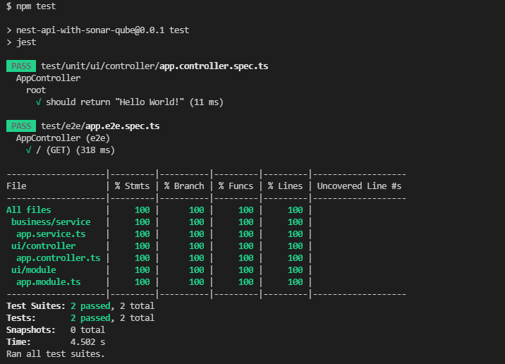

# Asesegurando a qualidade do código de sua API com SonarQube

## @beforeAll

Antes de tudo, quero reiterar que esse é um documento opinativo, baseado nas minhas experiências com a utilização da
ferramenta SonarQube. É possível que, após a escrita desse documento, o meu ponto de vista sobre essa ferramenta mude e
evolua. Também não me considero um mestre do uso da ferramenta aqui apresentada, e talvez a minha pouca experiência gere
algumas opiniões que sejam equivocadas ou incompletas. Portanto, conto com o seu feedback construtivo para que eu possa
continuar a evoluir profissionalmente com o uso dessas ferramentas.

## 1. Introdução

O SonarQube é uma ferramenta que serve para fazer a varredura completa do seu código, gerando um relatório de erros,
falhas, vulnerabilidades, entre outros pontos. Além disso, caso seu projeto tenha testes, ele avalia a cobertura dos
testes do seu código. [MELHORAR DESCRIÇÃO]

// TODO <br/>
É possível validar a qualidade do código escrito em…

Nesse documento irei desenvolver uma API simples do zero com testes, semelhante à API desenvolvida no projeto que falo
sobre [documentação swagger com annotation vs arquivo](https://github.com/lucasrochagit/swagger-annotation-vs-yaml),
para ilustrar o processo de evolução e avaliação contínua da qualidade do código de uma API com o SonarQube.

## 2. Configurando o SonarQube e o SonarScanner

Caso queira reproduzir o desenvolvimento da API, vai ser necessário:

1. Uma IDE favorita (vou usar o [Visual Studio Code](https://code.visualstudio.com/) para esse projeto);
2. O [NodeJS](https://nodejs.org/en/) instalado na sua máquina;
3. O [NestJS](https://nestjs.com/) instalado como biblioteca global do NodeJS;

Para usar o SonarQube, vai ser necessário:

1. A versão 11 ou superior do [Java JDK](https://www.oracle.com/br/java/technologies/javase-jdk11-downloads.html);
2. Baixar o [SonarQube Community](https://www.sonarqube.org/downloads/) (versão portátil);
3. Baixar o [SonarScanner](https://docs.sonarqube.org/latest/analysis/scan/sonarscanner/) (versão portátil);

// TODO <br/>
O SonarQube é o [...]

Já o SonarScanner é a ferramenta que vai permitir que o seu projeto seja escaneado e validado, e o relatório gerado vai
para o SonarQube. [MELHORAR DESCRIÇÃO]

Segundo as recomendações de instalação da própria plataforma, o SonarQube e o SonarScanner devem ser descompactados na
raiz do disco C. Exemplo:

```
C:\SonarQube
C:\SonarScanner
```

Recomendo que descompacte os arquivos compactos na raiz do disco C e depois renomeie os diretórios conforme acima.

Em seguida, adicione às variáveis de ambiente (de preferência, as variáveis de ambiente de usuário) os seguintes
endereços:

- `C:\SonarQube\bin\windows-x86-64` — Para iniciar o SonarQube de qualquer lugar via terminal, com o
  comando `StartSonar` ou `StartSonar.bat`.
- `C:\SonarScanner\bin` — Para rodar o SonarScanner em qualquer projeto utilizando o comando `sonar-scanner [opts]` ou
  `sonar-scanner.bat [opts]`

## 3. Pondo a mão na massa

### 3.1 First things first

### 3.1.1 Iniciando o projeto

Utilize o comando `nest new nest-api-with-sonar-qube` no terminal para criar o projeto. Será criado um projeto com a
seguinte estrutura:

```html
src/
app.controller.spec.ts
app.controller.ts
app.module.ts
app.service.ts
main.ts
test/
app.e2e-spec.ts
jest-e2e.json
```

Gerado o projeto, vamos fazer o seguinte:

1. Remover o arquivo jest-e2e.json.
2. Renomear arquivos `jest-e2e.json` para `jest.e2e.json` e `app.e2e-spec.ts` para `app.e2e.spec.ts`  o
   padrão `dot.case` no nome dos arquivos.

Logo após, vamos reorganizar o projeto da seguinte forma:

```html
src/
business/
service/
app.service.ts
infrastructure/
ui/
controller/
app.controller.ts
module/
app.module.ts
main.ts
test/
e2e/
app.e2e.spec.ts
unit/
ui/
controller/
app.controller.spec.ts
```

Onde:

1. `src/business` contém todos os arquivos relacionados à camada de `negócio` da aplicação.
2. `src/infrastructure` contém todos os arquivos relacionados à camada de `infrastrutura` da aplicação.
3. `src/ui` contém todos os arquivos relacionados à camada de `interface` com o cliente da aplicação.
4. `test/e2e` contém todos os testes end-to-end.
5. `test/unit` contém todos os testes unitários.

Depois, é necessário redefinir as configurações padrão no projeto.

No `package.json`:

- No objeto `scrips`, em `test:e2e`, altere o valor para `jest -- test/e2e`.
- No Objeto `jest`, em `collectCoverageFrom`, altere o valor para `src/**/*.(t|j)s`.
- No Objeto `jest`, em `coverageDirectory`, altere o valor para `coverage`.

Em seguida, adicione os seguintes valores no `package.json`:

- No objeto `jest`, adicione a chave `collectCoverage` com o valor `true`, para o coverage dos testes seja definido por
  padrão.
- No objeto `jest`, adicione a chave `verbose` com o valor `true`, para que seja mostrada uma lista de todas as
  mensagens dos testes que foram executados (`describe` e `it`).
- No objeto `jest`, adicione no array `collectCoverageFrom` o valor `!src/main.(t|j)s`, para que o arquivo `main` seja
  ignorado na cobertura de testes.
- No objeto `script`, adicione a chave `test:unit` com o valor `jest --coverage=false -- test/unit`. Vai ser útil para
  executar us testes unitários.

Agora, abra o terminal na raiz do projeto e execute o comando `npm test`. O resultado no terminal deve ser semelhante ao
da imagem abaixo:



Após isso, execute o comando `npm run test:unit`. O resultado no terminal deve ser semelhante ao da imagem abaixo:


Por fim, execute o comando `npm run test:e2e`. O resultado no terminal deve ser semelhante ao da imagem abaixo:


### 3.1.2 Configurando o Sonar

Primeiro, vamos configurar o SonarQube para manter o rastreio do projeto localmente. Para isso, execute o SonarQube
localmente, abrindo o terminal e executando o comando `StartSonar` ou `StartSonar.bat`. O Sonar irá ser carregado e, ao
fim do carregamento, acesse no navegador o endereço `http://localhost:9000`. Você será redirecionado para a tela de
login.


Para efetuar o login, use as credenciais `login: admin` e `senha: admin`. Você será redirecionado para a página inicial
do SonarQube.


Selecione a opção `Manually` para iniciar a configuração manual do projeto. Irá aparecer esse menu:


A primeira etapa é definir o nome do projeto. Nesse caso, irei definir como o nome do projeto que está no arquivo
`package.json` da API, que é `nest-api-with-sonar-qube`. Automaticamente, a chave do projeto será definida com o mesmo
nome do projeto. Clique em `Set Up` para continuar. Você será redirecionado para um menu para definir como o seu projeto
irá ser analisado.


Para os propósitos aqui definidos, selecione a opção `Locally`. Porém, sinta-se livre para explorar outras
possibilidades futuramente.

Após isso, defina um token para o seu projeto. Esse token será necessário para identificar você no momento em que for
executar o `SonarScanner`.


Você pode colocar qualquer coisa. Para facilitar, irei utilizar o meu usuário do github `lucasrochagit`. Clique em
`Generate`, e depois clique em `Continue`. Após isso, selecione o `build` do seu projeto.


Selecione a opção `Other(for JS, TS, Go, Python, PHP, ...)`, que é o nosso caso. Após isso, selecione o seu sistema
operacional (no meu caso, `Windows`)


Irá aparecer um manual de como configurar o `SonarScanner` (o que já fizemos no tópico 2) e um comando para executar o
`SonarScanner` na raiz do projeto. Não iremos utilizar esse comando propriamente dito, mas uma forma mais elegante,
através de um arquivo de configuração que vai ficar na raiz do projeto. Para isso, crie um arquivo
chamado `sonar-project.properties` na raiz do diretório da API. O arquivo deverá ter os parâmetros abaixo:

```html
# must be unique in a given SonarQube instance
sonar.projectKey=nest-api-with-sonar-qube

# defaults to project key
sonar.projectName=nest-api-with-sonar-qube

# the sources that should be analyzed
sonar.sources=src

# the sources or files that should not be analyzed
sonar.exclusions=.eslintrc.js,src/main.ts

# the sonar host url
sonar.host.url=http://localhost:9000

# your user token
sonar.login=

# version of project
sonar.projectVersion=1.0

# encoding of the source code
sonar.sourceEncoding=UTF-8

# specify the file that contains the coverage info
sonar.javascript.lcov.reportPaths=coverage/lcov.info
```

Preencha o parâmetro `sonar.login` com o token que foi gerado no passo anterior.

### 3.2 Executando nossa primeira avaliação

Vamos avaliar o nosso código no sonar. Para isso, abra o terminal na raiz do projeto e execute o comando `sonar-scanner`
. Esse processo geralmente é um pouco demorado, portanto, seja paciente.

Enquanto seu projeto está sendo escaneado, caso você deseje subir o seu projeto para o Github ou Gitlab, adicione no
arquivo `.gitignore` da API as seguintes linhas:

```html
# SonarScanner scan dir
.scannerwork

# SonarScanner scan script
sonar-project.properties
```

Caso queira subir um arquivo de exemplo, para que você ou outras pessoas possam utilizar o `sonar-scanner` no seu
projeto, crie um arquivo chamado `sonar-scanner.properties.example` e adicione os parâmetros supracitados. Lembre-se de
nunca subir para o seu repositório chaves privadas ou conteúdos restritos, logo, deixe o parâmetro `sonar.login` em
branco.

Voltando ao `sonar-scanner`, quando o escaneamento do projeto for concluído, você irá verificar a seguinte mensagem no
terminal:


Portanto, acesse o endereço indicado na primeira linha ou, caso não tenha fechado a aba do `SonarQube`, basta atualizar
a página, e você irá ter o relatório completo do escaneamento do projeto.


Você pode explorar as demais abas para mais detalhes. Mas esse painel inicial já resume tudo que precisamos saber. Até
então nosso código está perfeito. Vamos partir para a implementação.

### 3.3 Implementando o projeto

Antes de prosseguir a implementação, vamos implementar algumas bibliotecas e realizar algumas configurações. Para isso,
iremos executar o comando:

`npm i --save @nestjs/config @nestjs/typeorm typeorm sqlite3 class-validator class-transformer`

Onde:

- `@nestjs/config`: biblioteca que será útil para leitura de variáveis de ambiente de um arquivo `.env`.
- `@nestjs/typeorm typeorm`: Bibliotecas que irão facilitar a integração da aplicação com banco de dados
- `sqlite3`: banco de dados relacional, que cria e mantém as tabelas localmente, sem a necessidade de um software
  pré-instalado na máquina, como MySQL.
- `class-validator`: biblioteca que serve para realizar uma série de validação de dados de entrada (será utilizado mais
  na frente, na implementação da camada `ui`)
- `class-transformer`: biblioteca que serve para fazer a serialização/deserialização de uma objeto ou uma classe para
  outra classe (será utilizado mais na frente, na implementação da camada `ui`).

Após instalar as bibliotecas, crie um arquivo chamado `.env` na raiz do projeto. Adicione os seguintes parâmetros:

```text
# PORT
# description: http port from app
# example: 3000
PORT=3000
```

Lembre de adicionar o arquivo `.env` no `.gitignore`. Você pode adicionar da seguinte forma:

```text
# Environment 
.env
```

Considerando que o arquivo `.env` vai ser requerido para o funcionamento correto do sistema, crie também um
arquivo `.env.example` na raiz do projeto, para que futuramente você ou quem for usar o projeto possa ter uma ideia do
comportamento das variáveis de ambiente. Não esqueça de configurar o `.env.example` de forma a não enviar conteúdo
sensível para o repositório.

No arquivo `main.ts`, adicione as configurações de validação. Ele deve estar configurado da seguinte forma:

```ts
import { ValidationPipe } from '@nestjs/common';
import { NestFactory } from '@nestjs/core';
import { AppModule } from './ui/module/app.module';

async function bootstrap() {
    const { PORT } = process.env;
    const app = await NestFactory.create(AppModule);
    app.useGlobalPipes(new ValidationPipe()); // validate submitted data
    await app.listen(PORT);
}

bootstrap();
```

Agora, configure o Typeorm e o módulo de leitura de variáveis de ambiente no arquivo `app.module.ts`. Ele deve estar
configurado da seguinte forma:

```ts
import { Module } from '@nestjs/common';
import { AppController } from '../controller/app.controller';
import { AppService } from '../../business/service/app.service';
import { ConfigModule } from '@nestjs/config';
import { TypeOrmModule } from '@nestjs/typeorm';

@Module({
    imports: [
        ConfigModule.forRoot(), // config used to load environment variables
        TypeOrmModule.forRoot({
            type: 'sqlite', // type of database used on typeorm
            database: '.database/nest-api-with-sonar-qube.db', // database path
            autoLoadEntities: true, // load all entities defined in another modules
            synchronize: true, // sync tables with entity definitions automatically (for dev purposes)
        }),
    ],
    controllers: [AppController],
    providers: [AppService],
})
export class AppModule {
}
```

Feitas as devidas pré configurações, podemos seguir para as implementações.

### 3.3.1 Camada de Infraestrutura

A primeira camada a ser implementada será a camada de infraestrutura. Essa camada deverá ter os seguintes diretórios:

```html
src/
business/
infrastructure/
entity/
repository/
ui/
```

Onde:

- `entity`: irá conter as entidades da base de dados.
- `repository`: irá conter as implementações dos repositórios e de suas interfaces;

Vamos criar então a classe `UserEntity`. Para isso, basta criar um arquivo no diretório `src/infrastructure/entity`
denominado `user.entity.ts` . Ele deve estar configurado da seguinte forma:

```ts
import { Column, Entity, PrimaryGeneratedColumn } from 'typeorm';

@Entity('user')
export class UserEntity {
    @PrimaryGeneratedColumn()
    id: number;

    @Column()
    name: string;

    @Column()
    age: number;

    @Column()
    job: string;
}
```

Criada a entidade `UserEntity`, vamos partir para a criação do repositório. De antemão, devemos criar a interface do
repositório da entidade em questão. Eu gosto de criar uma interface genérica, que contém todos os métodos comuns aos
repositórios, que são as operações CRUD, e assim as demais interfaces dos repositórios podem estender a interface
genérica, simplificando a implementação. Portanto, em `src/infrastructure/repository` devemos criar
diretório `interface`. Em `src/infrastructure/repository/interface`, devemos criar o arquivo `repository.interface.ts`
. Ele deve estar configurado da seguinte forma:

```ts
export interface IRepository<Entity, IdType> {
    create(item: Entity): Promise<Entity>;

    find(): Promise<Entity[]>;

    findById(id: IdType): Promise<Entity>;

    update(id: IdType, item: Entity): Promise<Entity>;

    delete(id: IdType): Promise<void>;

    checkExists(params: any): Promise<boolean>;
}
```

Em seguida, devemos criar a interface `IUserRepository`. Para isso, basta criar o arquivo `user.repository.interface.ts`
, no mesmo diretório do arquivo `repository.interface`. Ele deve estar configurado da seguinte forma:

```ts
import { UserEntity } from '../../entity/user.entity';
import { IRepository } from './repository.interface';

export interface IUserRepository extends IRepository<UserEntity, number> {
}
```

Seguindo a linha da interface genérica, eu gosto de criar uma classe, denominada `BaseRepository`. Essa classe deverá
conter todos os métodos comuns aos repositórios, implementando a interface `IRepository` criada anteriormente. Portanto,
no diretório `src/infrastructure/repository` devemos criar um diretório chamado `base` e, no
diretório `src/infrastructure/repository/base`, criamos o arquivo `base.repository.ts`. Ele deve estar configurado da
seguinte forma:

```ts
import { IRepository } from '../interface/repository.interface';
import { Repository } from 'typeorm';

export class BaseRepository<Entity, IdType>
    implements IRepository<Entity, IdType> {
    protected constructor(readonly _repository: Repository<Entity>) {
    }

    async create(item: Entity): Promise<Entity> {
        return await this._repository.save(item);
    }

    async find(): Promise<Entity[]> {
        return await this._repository.find();
    }

    async findById(id: IdType): Promise<Entity> {
        return await this._repository.findOne(id);
    }

    async update(id: IdType, item: Entity): Promise<Entity> {
        await this._repository.update(id, item);
        return this.findById(id);
    }

    async delete(id: IdType): Promise<void> {
        await this._repository.delete(id);
    }

    async checkExists(params: any): Promise<boolean> {
        const result: Entity = await this._repository.findOne(params);
        return !!result;
    }
}
```

Após isso, podemos implementar a classe `UserRepository`. Para isso, basta criar um arquivo no
diretório `src/infrastructure/repository` denominado `user.repository.ts` . Ele deve estar configurado da seguinte
forma:

```ts
import { Injectable } from '@nestjs/common';
import { InjectRepository } from '@nestjs/typeorm';
import { Repository } from 'typeorm';
import { UserEntity } from '../entity/user.entity';
import { BaseRepository } from './base/base.repository';
import { IUserRepository } from './interface/user.repository.interface';

@Injectable()
export class UserRepository
  extends BaseRepository<UserEntity, number>
  implements IUserRepository
{
  constructor(
    @InjectRepository(UserEntity)
    protected readonly _repository: Repository<UserEntity>,
  ) {
    super(_repository);
  }
}
```

Agora vamos implementar os testes da camada de infraestrutura.

### 3.3.3 Camada de UI

A princípio, apenas uma entidade será tratada nessa API: a entidade `User`. Ela deverá conter os seguintes parâmetros:

```ts
interface User {
    name: string;
    age: number;
    job: string;
}
```

Antes de começarmos as implementações, devemos criar o `UserModule`, módulo que deverá conter todas as configurações
referentes à entidade `User`. Para isso, basta criar um arquivo no diretório `src/ui/module` denominado `user.module.ts`
. Ele deve estar configurado da seguinte forma:

```ts
import { Module } from '@nestjs/common';

@Module({
    imports: [],
    controllers: [],
    providers: [],
})
export class UserModule {
}
```
